# Réseau et systèmes - Synthèse

[TOC]

## 1. OS

- Faire l’interface entre:

  - **les demandeurs** (applications dites utilisateur) en ressources (espace memoire, fichiers, connexions reseaux, ...)
  - **les ressources** disponibles : processeurs, memoire, disques, carte reseau, ...

- Gerer les offres et les demandes dans leur ensemble, pour arbitrer leur attribution:
  - **dans l’espace** (allocation)
  - **dans le temps** (ordonnancement)

## 2. Organisation

### 2.1. Modèle de Von Neumann (1946)

- Un `processeur` pour les calculs.
- La `mémoire` pour initialiser et sauvegarder les résultats.
- Les `périphériques` d'entrée pour charger les données.
- Les `périphériques` de sortie pour restituer les résultats.

Ces entités sont reliées les unes aux autres par **des bus**.

## 3. Architecture

### 3.1. Processeur

**CPU** : central processing unit

**Rôle** : 
1. Exécuter séquentiellement des instructions (aller cherches les instructions en mémoire puis les exécuter).
2. Effectuer des opérations élémentaires sur des données (valeurs numériques ou adresses mémoires) 

#### 3.1.1. Caractéristiques

- fréquence de fonctionnement (GHz, MHz)
- instructions par seconde (MIPS)
- tailles des données traitiées (bits)

_Familles:_ interprête un même language machine (ex: x86, ARM, Xscale)

_Emulateur:_ traduit à la volée des instructions d'une famille a l'autre

#### 3.1.2. Unités: Divisions du processeur

- **Unité de commande:**
	- Orchestre les instructions à executer (métronome dans l'archi de Von Neumann).
	- Formé de plusieurs registres (ex: compteur ordinal, mémorise l'adresse des instructions)
- **Unité de traitement:**
	- Réalise le calcul.

2 types de registres: 
1. `Etat` (ex: retenue lors de l'addition) 
2. `Generaux` (accumulateur, données)

#### 3.1.3. Horloge: Synchronisation des opérations

Fréquence fixe (en Hz): cycles par seconde
Cadence l'ensemble des périphériques, pour qu'ils soient synchronisés.
=> envoi des messages, on sais si le bus est occupé ou pas
=> dans la réalité, c'est le processeur qui demande d'écrire ou de lire des données

#### 3.1.4. Registe: zones de mémoire

**Définition**:
+ Petites zones de mémoires internes au CPU, à l'accès rapide
+ Dont la capacité est très limité, mais peut contenir au choix :
  - un entier
  - un flottant
  - une adresse

**Références:**

- `eax`, `ebx`, `ecx`, `edx`: géneraux (32bits, entiers et adresses)
- `eip`: pointeur courant (instruction actuelle)
- `esp`: pile, variables locales aux fonctions

#### 3.1.5. Bus

Définition :
+ Réunion des parties matérielles et immatérielles qui permet la transmission de données entre les composants participants (liaison physique d'un matériel vers un autre).
+ `x` fils => bus de largeur `x` (ex: 16 bits => 16 fils)

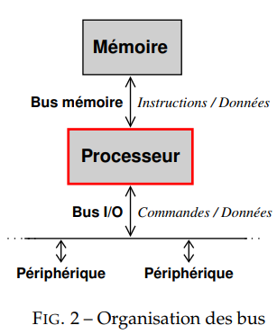

Différents types : 
- 3 principaux :
  - bus d'`adressage` => fournis l'adresse (dans la carte mémoire, réseau etc) (unidirectionnel)
  - bus de `contrôle` => fournis la commande a exécuter (ex: lecture/écriture) (bi-directionnels)
  - bus de `données` => fournis la donner a faire transitionner (valeur) (bi-directionnels)

Des bus plus complexes existent, tels que :
- bus `mémoire`: processeur <-> RAM (mov)
- bus `I/O`: autres périphériques (bus PCI, AGP, ISA, IDE...)

Sur PC, les deux sont confondus, mais pas la même vitesse/largeur de données.

Les `chipsets` assurent l'interconnexion bus <-> processeur

Donc sur PC, quand on accède a une adresse par le "bus mémoire", on tombe sur:

- de la mémoire physique, ou le bios => adresses basses
- un périphérique matériel (récent) => projeté, mappé en mémoire physique
- rien du tout

Un bus traverse la carte mère, et est partagé entre les différents périphériques (_ex:_ RAM <-> NET <-> CPU)

#### 3.1.6. Ports I/O: bus sur PC ou chaque adresse est un port (16bits)

Accès aux vieux périphériques (standard PC, contrôleurs d'interruptions, bus ISA, ...)

Deux familles d'instructions:

- entrée: `inb` (8bits), `inw` (16bits), `inl` (32bits)
- sortie: `outb` (8bits), `outw` (16bits), `outl` (32bits)

#### 3.1.7. Interruptions: simple fil reliant un périphérique au processeur

+ Un ligne d'interruption, comme étant un simple fil reliant un périphérique (ex. contrôleur clavier, carte réseau) au processeur. 
  + Le rôle de ce fil est d’être dans un état (0/1), quasiment toujours identique sauf quand un évenement remarquable se produit (touche clavier, paquet réseau...)
  + Quand le processeur detecte un changement d'état, il interrompt le programme associé a l'interuption et fait un saut vers une routine (petit programme) pour faire un traitement, avant de retourner dans le flot d'instructions interrompus.

=> performance, evite de faire du polling (attente active).

- PC originel: 16 lignes d'interruptions sur 2 contrôleurs (PIC, Programmable Interrupt Controller) en cascade (donc 15 utilisables).
- PC modernes: le processeur joue le role des controlleurs (256 lignes)

### 3.2. Mémoire

Stockage des données, chaque "tiroir" a une adresse permettant de le localiser.

_n_ bits par adresse => _2^n_ adresses/tiroirs

#### 3.2.1. Mémoire volatile: RAM

- Statique (`SRAM`)
  - DRAM FPM (1987)
  - DRAM EDO (1995)
  - SD-DRAM (1997)
  - DDR SD-RAM (2000)
- Dynamique (`DRAM`).
  - Flash EPROM (ou le BIOS est stoqué)

#### 3.2.2. Mémoire persistante: ROM

=> permanente, facile d'accès en lecture mais pas en écriture.

### 3.3. Carte mère

Assure la connexion et la communication entre les composants.

Support pour le processeur (socket), horloge pour cadencer les bus...

### 3.4. Carte vidéo

#### 3.4.1. Cartes Hercules

Résolution:

- 80x25 /43x25 en alphanumérique (ASCII)

Cartes Hercules (`HGC`)

> Micro-controleur qui lis de facon pérpétuelle dans la barette de RAM pour mettre à jour l'affichage
> comme le balayage du canon à électron pour les écrans cathodiques.

2 octets pour un char (matrice de res 2 x 80 x 25, en mémoire sous forme linéaire)

1 octet (8bits):

- couleur char (3bits)
- couleur fond (3bits)
- clignotement (2bits)

#### 3.4.1. VGA (simple)

Résolution:

- 640x480 en 16 couleurs
- 320x200 en 256 couleurs

ou

**Mode hercule** (voir plus haut)

#### 3.4.2. GPU (complexe)

Affichage d'images

## 4. Périphériques

- Un périphérique informatique est un terme générique donné aux composants de matériel informatique assurant les communications entre l'unité centrale de l'ordinateur et le monde extérieur.

- 3 types :
  - Périphérique d'`entrée`, ex: clavier (valeurs des touches en input)
  - Périphérique de `sortie`, ex: moniteur (ce qui est affiché en output)
  - Périphérique d'`entrée/sortie`, ex: clé usb (data à stocker en entrée, à récupérer en sortie)
  
### CRTC

La technologie d'affichage de l'écran cathodique :
- microcontrôleur chargé de manipuler l'écran vidéo
- communication par le biais de port

### Firmware

- programme intégré dans le materiel. Peut être mis a jour (ex: faille de sécurité).

### Driver

- programme sur l'OS faisant la traduction entre le périphérique et l'OS
- Spécifique à chaque périphérique et pour chaque constructeur.
- Compose 70% d'un OS. Chargé dans l'espace mémoire, dispose de tous les privilèges.
- => Risque: si le driver a un problème, l'OS s'arrête (Linux, 7x plus de bugs drivers que kernel).

### Mode d'accès aux périphériques

- Accès `direct` :
  - A chaque registre est associé un port
  - _Avantages : prise en charge de moins de ports_
  - _Désavantages : plus rapide_
- Accès `indexés` (Pour les périphériques possédant un grand nombre de registre (ou pas)) :
  - Le périphérique expose au processeur 2 ports :
    1. L’un pour désigner le numéro de registre interne au périphérique devant être accédé,
    2. L’autre contenant la valeur à lire ou à écrire dans le registre sélectionné.
  - Par exemple, le port série fonctionne par accès directe, mais le contrôleur vidéo par accès indexé. Le principe de fonctionnement du contrôleur vidéo est précisé ci-après.
  - _Avantages : prise en charge de plus de ports_
  - _Désavantages : plus lent_

## 5. L'Assembleur

Traduction directe d'un language machine (`binaire`) à un language humain (`opcodes`).

### 4.1. Syntaxe

Deux grandes syntaxes :
- `INTEL` syntaxe : instruction destination, source
- `AT&T` assembler : instruction source, destination

On appelle les instructions de base à réalisés : des `mnémoniques`, elles peuvent avoir pour but de :
- déplacer des données
- opérations mathématiques
- opérations logiques
- modifier le séquencement d'un programme (sauts, branchement)

Pour une ligne de mnémoniques, on parle de `opcode.

Architecture :
- `CISC` (actuelle): les opcodes ont des tailles variables,
```pseudocode
MOV adr1 adr2 => MOV (8 bits) + 2 PARAMS (2x16bits)
HALT => HALT (8bits)
```
- `RISC` (ancienne): tous les opcodes on la même taille
  - si un param n'est pas utilisé, il est remplacé par nul

### 4.2. Opérandes

#### 4.2.1. Types d'instructions

- `registre` : référence au contenu d’un registre.
- `mémoire` : référence aux données situés à l’adresse définie par l’opérande.
- `immédiate` : une opérande à valeur fixe.
- `implicite` : opérande est associé à l’instruction.

#### 4.2.2. Déplacement

- `MOV source, destination`

#### 4.2.3. Opérations

- `ADD operande*(reg/mem/imm), operande*(reg/mem/imm)`
- `SUB operande*(reg/mem/imm), operande*(reg/mem/imm)`
- `INC operande\_(reg/mem/imm)`
- `DEC operande\_(reg/mem/imm)`

#### 4.2.4. Comparaison

- `CMP operande1*(reg/mem/imm), operande2*(reg/mem/imm)`
  registre FLAGS: drapeaux zéro (ZF) et retenue (CF)

#### 4.2.5. Saut

- `GOTO`: a éviter (remplace le nom de l'adresse par l'instruction) peu efficace
- `JMP`: sauts longs => espace code et rapidité
  intègre des conditionelles avec les FLAGS JZ => (ZF / CF) et JC (CF / ZF)
- `LOOP`: décrémente ECX tq > 0
- `CALL`: appel de procédure

## 6. Compilation

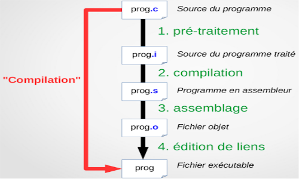

1. `Fichiers code (.c)`

- Etape de précompilation (preprocessing) (remplacement des macros)

2. `Fichiers précompilés (.c)`

- Compilation en binaire

3. `Fichiers binaires (.o)`

- Linkage des variables entre les plusieurs fichiers + point d'entrée (pas vraiment ça)
- Evaluation des #include référencant d'autres fichiers (headers - .h ou .hpp)
- _2 types de link :_
  - _Statique_ : les fichiers additionnels sont "fusionnés" dans l'executable principal (target) - on se retrouve à la fin avec un seul .exe comportant tout l'arbre de dépendances
  - _Dynamique_ : édition de "symboles" contenus dans l'executable principal (target) pour référencer les dépendances (.dll sous windows, .so sous unix) qui seront chargés au lancement du programme

4. `Fichier binaire (.exe)`

- avec potentiellement des .dll ou .so si link dynamique (qui sont aussi binaires)

C'est ensuite le BIOS qui prends la main => BIOS mort, plus de pc
Exemple d'erreur : "BOOT disc not found"

- référence en dur vers les disques, première instructions
  (ex: Noyau à l'adresse 0x00000)
- possible de modifier les instructions
  (ex: lecture ecriture barettes mémoires pour vérifier si il y a des cellules qui ne sont plus opérationelles)

## 7. GRUB

Choix du système a démarrer (dual boot...) + évolué qu'un bios (ex: peut booter sur le réseau => OS pas sur le disque dur mais en réseau sur un serveur)

### Attentes des périphériques

2 types d'attentes :

- `active`: demande en boucle tant que pas de réponse
- `passive`: attente d'une réponse

#### Interuptions

Définition :
- point de vue : 
  - informaticiens : Les interruptions sont des évènements qui interrompent le flot d’exécution du processeur 
  - éléctroniciens : C'est une ligne d'interruption, comme étant un simple fil reliant un périphérique (ex. contrôleur clavier, carte réseau) au processeur.
- Le rôle de ce fil est d’être dans un état (0 ou 1) quasiment toujours identique sauf quand quelque chose de remarquable se produit (ex. l’utilisateur vient d’appuyer sur une touche)
- Lorsque le processeur détecte que la ligne d’interruption change d’état, il interrompt le programme qui est en train d’être exécuté, et fait un saut vers la première instruction d’un petit programme, ou `handler/routine` ( `ISR`), destiné à effectuer un traitement associé à cette interruption.

Code d'interuption: `iret`. 

3 types :

- `processeur / exception`: evenement critique (ex: division par 0) (**synchrone**)
- `logicielle`: instruction INT ou INT8 (ex: breakpoint dans le code) (**appel systèmes**)
- `materielle`: courant electrique envoyé au CPU (ex: appui a une touche du clavier) (**asynchrone**)

#### Contrôleurs d'interruption et les `IRQ`.

`IRQ` (Interrupt ReQuest) : 
+ ce sont des interruptions provenant du matériel externe au processeur.
+ Registre `IDTR`(Interrupt Descriptor Table) : 

Evolution : 
+ Avant : 
  + 8bits * 1 => 8 interruptions possibles
+ Maintenant : 
  + 8 bits * 2 (Maitre et Esclave) = 16 bits => 15 interruptions possibles : 
  + Cascade au 2ème bits
  + 2^8 entrées

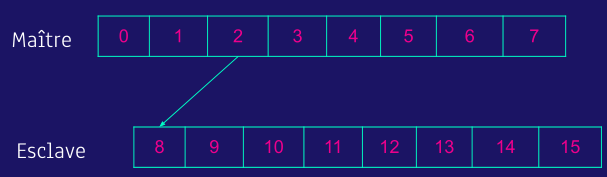

Priorité: 0 > 1 > 8 - 15 > 3 - 7

## Activité

Ensemble de code et de données s'éxécutant sur le processeur.
L'ensemble des activités d'un programme partagent le code et le tas.
Une activité est un thread.

### Variables

Définition
+ Zone de mémoire nommée

2 types de variables :
1. locales à une fonction
2. globales

Les variables locales sont mis en place par l'appelé.

#### Tas (_heap_)

Définition
- **Espace mémoire** dédié à l'allocation **dynamique** **pendant** l'exécution d'un programme (ex. *pointeurs, malloc, memfree*)

Il est situé physiquement au début de la barette de RAM.

Objectif : 
- stocker des données utilisateur

3 fonctions:
- Initialiser du pointeur (`new`)
- Récupération de la taille pour stocker `n` octets pour un objet (`getmem`(int taille))
- Ecraser la mémoire pas des zéros (`freemen`(int adresse, int taille))

#### Pile (_stack_)

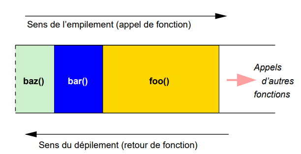

Définition :
- **Espace mémoire** (`Last In First Out`) dédié à l'allocation **statique** **au lancement** d'un programme (ex. *variables*) 

Objectif :
- La pile sert à mémoriser le flot d'empilement/éxécution entre les fonctions appelantes et appelées (d'une activité).
  - si la fonction *f* appelle *g* : *g* sera en haut de la pile.

La réservation et la libération sont gérées automatiquement par le compilateur. Cette gestion est basée sur les intructions du langage de programmation utilisé.
- création par allocation (réservation).
- destruction par désallocation (libération).

Elle possède : 
- `paramètres` : toute variables passées à la fonction pour traitement
- `variables locales` : toutes les variables définies dans la fonction de la frame
- `adresse de retour` : instruction définie par la fonction appelante 
- le pointeur `this`

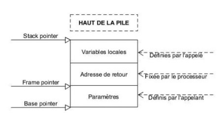

Registres :
- Base pointer `EBP`: début de frame
- Stack pointer `ESP`: fin de frame
- Frame pointer `EIP`: adresse de retour
- `EBS`

Sauvegarde du contexte d’éxécution :
+ Etapes : 
  + sauvegardes des registres
  + sauvegarde du pointeur de pile
+ Illustration : 
  + Etat de la pile à l’issue des empilements pour la sauvegarde du contexte
  + 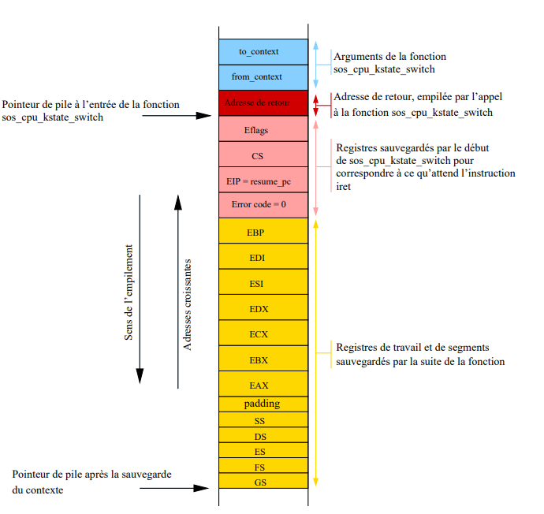

#### Frame

Définition : 
Lot de données qui est poussé ensemble sur la pile.

Contenu :
- `variables locales
- `adresse de retour`
- le pointeur `this`

Registres : `EBP`, `ESP`, `EIP`.

#### Débordement de pile

La pile doit être de taille limitée mais suffisamment grande pour contenir une profondeur raisonnable d’imbrication d’appels de fonction. Si on la dimensionne mal, les frames risquent d’en sortir (on parle d’un “débordement de pile”), ce qui peut se traduire par des écrasements de donnees

#### Allocation, utilisation et libération

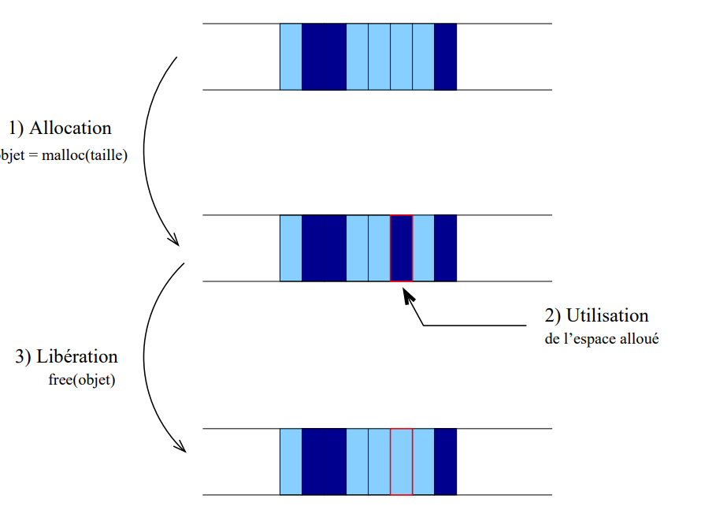

Configurations avant/après allocation d’une nouvelle region.

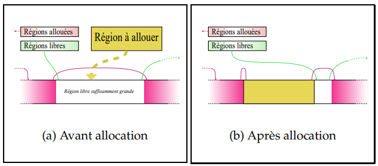

Dans cette configuration, la libération de l’objet en rose à droite va entraîner la libération de slabs en rafale : 

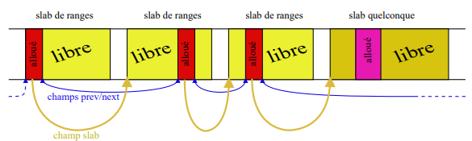

#### Attaque par Buffer Overflow

C'est l'exploitation d'une faille de mémoire, durant laquelle l'écriture en mémoire du buffer de la pile d’exécution dépasse son espace mémoire alloué. Le processus subit alors une modification des informations nécessaires au fonctionnement du programme. (source).

L'idée serait de rediriger l'adresse de l'EIP (adresse de l'instruction courante) vers une partie du programme que l'on souhaiterai exécuter (en général, programme injecté dans la pile d'exécution). Pour cela on peut modifier l'adresse du pointeur de retour d'une instruction.

Un de ses avantages est qu'il n'y a pas besoin d'avoir accès à la machine victime.

**Etapes**:

1. Allocation d'une taille BUFSIZE a une variable
2. Entrée de données d'une taille supérieure a BUFSIZE dans la var
3. Dépassement sur les variables successives
4. Lors de l'appel des variables successives, c'est le code malicieux qui sera appelé (et la suite de la pile est ignorée)
5. Pour que le code soit immédiatement executé, on peut écrire son adresse dans le retour

**Causes** :
+ lectures non-flitrée de donné par utilisateur (`injection`)
+ code trop complexe (`comportement impossible à prédire`)
+ manque de délimitation du code (`bounds-checking`)

## 8. Synchronisation

### Notions

Système multitache : threads interrompus (eux mêmes, ou ordonnanceur)

Problème: programme imprévisibles (accès a une même ressource dans les deux threads, mais pas de possibilité de connaitre l'ordre)

Les trois notions de threads, d’ordonnancement et de synchronisation sont très liées :

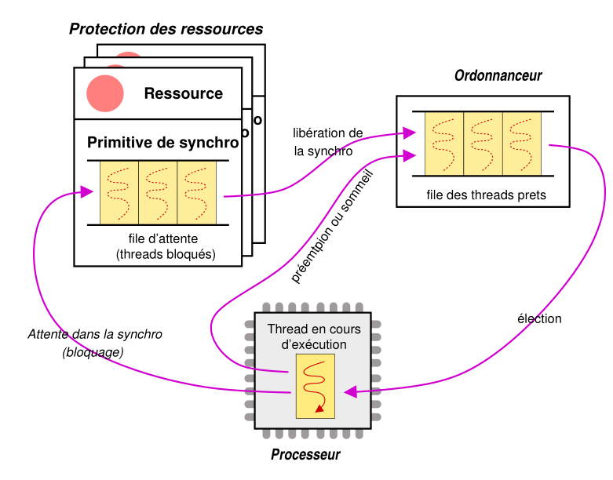

#### Ressource critique

Ressource pour laquelle il faut réguler l'accès.

2 types de sections :
- Section `critique`: instructions accédant à une ressource critique.
- Section `atomique`: jamais interrompue, tout le temp executé dans son intégrité (ex: attribution a une variable)

#### `Primitive` de synchronisation (une par ressource géré par l'OS) 

+ Objet particulier de l'OS, à associer aux ressources à gérer. 
+ Objectif : former une instruction atomique, afin de réguler les accès aux ressources critiques par les threads.

#### Threads (plusieurs dans le système)

+ Registre du processeur, dont une pile (tas) de données et une zone de code.
+ Flot d’instructions à exécuter sur un processeur. Un thread peut être (entre autres) en cours d’exécution sur le processeur, bloqué dans une primitive de synchronisation, ou “prêt”.
+ ll s’agit d’une structure de données manipulée par l’OS qui est constituée principalement de **2 éléments essentiels** : 
	+ un `contexte d’exécution` 
	+ un `état`.

2 types de threads :
1. noyau
2. utilisateur

Cycle de vie d'un thread : 
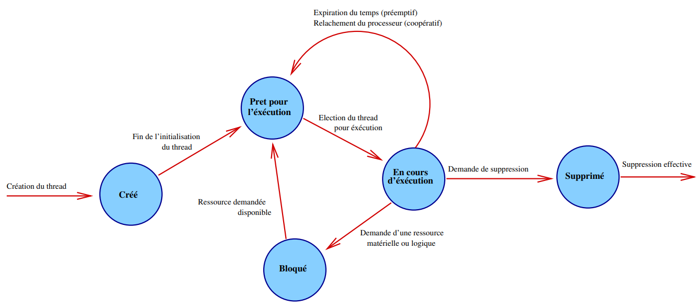

#### Ordonnanceur (un seul dans tout le sytème)

+ Sous- partie de l’OS s’occupant de la gestion de la ressource “processeur”. Gère la “file des (threads) prêts”, c’est-à-dire la liste des threads non bloqués mais en attente du processeur ("dispatcher" les threads "prêts" sur le processeur). 

##### Ordonnancement

**2 types d'ordonnancement** :
1. `Coopératif` : les threads se rendent la main mutuellement à la fin de leurs activités
2. `Préemptif` : une partie tierce s'occupe de donner la main aux threads selon une certaine politique : périodiquement avec un timer, sur interruption, etc
3. `Coopératif direct`

**algorithmes d’ordonnancement** :
1. Premier arrivé, premier servi (First Come, First Serve `FCFS`)
2. Ordonnancement par ordre croissant de temps d’exécution (Shortest Job First `SJF`)
3. Tourniquet (`Round-Robin`) : les activités avancent à la même vitesse.
4. Priorité (`Priority`)

L'ordonnancement (dans le temps) se différencie de l'allocation (dans l'espace).

### Mécanismes

#### Verrou

+ Empecher les autres threads d'accéder a la ressource
+ Deux opérations: `lock` / `unlock`

#### Sémaphores

+ Pouvoir controller finement le nb de process qui peuven taccéder.
+ Sac de clés pour accéder a la ressource, mais nombre de clé limité
+ Trois opérations: `init` / `down` / `up`

#### Mutex (mutual exclusion)

- 1 seul jeton, sémaphore binaire.
- Mutex, pour exclusion mutuelle, sert à empêcher deux processus d'accéder à une même ressource critique en même temps.
- En java on peut utiliser l'instruction `synchronized`.

#### Verrou de rotation

Protéger une ressource partagée en mode multiprocesseur.

Lock une ressource, les autres demandes sont en attente de la fin du premier traitement.
=> attente active, appels succéssifs jusqu'a réponse positive (cycles cpu gachés)
=> attente passive (mis en WAIT state), et on le préviens quand c'est fini (mais chgmt d'état, + lent)

Suppose que les zones critiques ont une durrée d'execution courte (ex: ecriture).

Utilisé avec parcimonie, que dans les kernels.

`xchf` => atomique, permet de swap des variables (etat précédent avec courant)

### Problèmes

#### Deadlocks

Deux threads qui veulent partager deux ressources simultanément

Chaque thread a une ressource mais a besoin de l'autre pour continuer.
=> Les deux sont donc en attente de l'autre.

#### Famine (_starvation_)

Plusieurs lecteurs, un écrivain. Perpetuellement des lecteurs mais l'écrivain ne peut écrire que si personne ne lis.
L'écriveur est donc bloqué.

Causes :
+ `shortest job first`
+ `FCFS` avec priorités


## 8. Mémoire

Avant lancement du programme => déclaratio, de la taille de mémoire a allouer pour chaque type

### Segmentation

Allocation de mémoire contigue pour chaque var si possible.
Si déja des emplacements utilisés par des variables, fractionnement sur les espaces succésivements disponibles.

=> Mémoire virtuelle (MMU) map de mémoire physique en virtuel (abstraction en pages).
Peut être ajusté pendant l'execution. Affranchissement de la segmentation pour utiliser toute la RAM dispo.
Permet également de stoquer des données en RAM (swop).

### MMU (Memory Management Unit)

Pages (virtuel) et Cadres (physique)

<https://en.wikipedia.org/wiki/Page_table>

Defaut de page (exceptions levées par le MMU)
